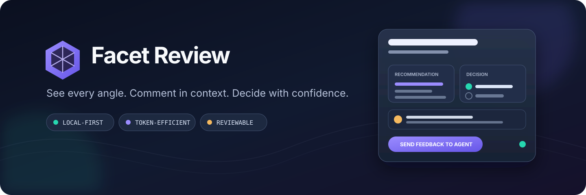
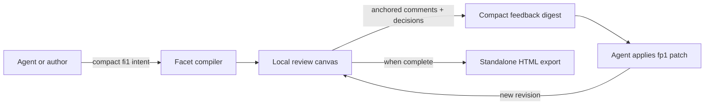

<p align="center">
  
</p>

<p align="center">
  <a href="https://www.npmjs.com/package/facet-review"></a>
  <a href="https://github.com/VishalMakwana23/facet-review/actions/workflows/ci.yml"></a>
  
  <a href="LICENSE"></a>
</p>

<p align="center">
  <strong>A local-first review canvas for thoughtful human–agent decisions.</strong><br />
  Plans, comparisons, reports, and architecture reviews become accessible visual workspaces with anchored comments, explicit decisions, and compact revisions.
</p>

<p align="center">
  <a href="#quick-start">Quick start</a> ·
  <a href="#use-facet-with-codex">Use with Codex</a> ·
  <a href="#user-manual">User manual</a> ·
  <a href="#command-reference">CLI reference</a> ·
  <a href="SECURITY.md">Security</a>
</p>

---

## Why Facet?

Long agent responses are useful for delivery, but awkward for review. Important trade-offs get buried, feedback loses its context, and every revision risks repeating the entire document.

Facet separates **meaning** from **presentation**:

| Without Facet | With Facet |
|---|---|
| Scroll through a long response | Navigate a decision-ready workspace |
| Describe where feedback belongs | Comment on the exact section or selection |
| Repeat the full artifact after edits | Apply a compact, versioned patch |
| Mix discussion with approval | Record explicit approve/revise decisions |
| Depend on a hosted review service | Keep the session and data on your machine |

### What it is good for

- Implementation and delivery plans
- Architecture and design reviews
- Option comparisons and decision briefs
- Incident retrospectives and risk reviews
- Research reports and structured proposals
- Any substantial agent output that benefits from precise human feedback

Facet is intentionally not a general website builder. Small answers that are clearer as prose should stay in the conversation.

## How it works



The agent authors compact semantic content. Facet owns the rendering, responsive layout, accessibility, review state, and revision history. That keeps the review experience consistent without asking the agent to regenerate a large interface on every turn.

## Quick start

### 1. Install the public alpha

Facet requires Node.js 22.14 or newer.

```bash
npm install --global facet-review@alpha
facet doctor
```

Prefer not to install it globally? Run any command with npm exec:

```bash
npm exec --yes --package=facet-review@alpha -- facet --help
```

### 2. Create a compact review

Save this as `decision.fi1.json`:

```json
[
  "fi1",
  "launch-decision",
  "Launch readiness review",
  ["compare options", "record decision"],
  [
    ["section", "Goal", "Choose a safe launch path with clear ownership."],
    [
      "comparison",
      "Options",
      "Compare speed and operational risk.",
      {
        "headers": ["Criterion", "Launch now", "Pilot first"],
        "rows": [
          ["Learning speed", "High", "Medium"],
          ["Operational risk", "High", "Low"]
        ]
      }
    ],
    [
      "decision",
      "Launch path",
      "Record the direction after reviewing the trade-offs.",
      {"options": ["Launch now", "Run a pilot first"]}
    ]
  ]
]
```

### 3. Validate and open it

```bash
facet lint decision.fi1.json
facet open decision.fi1.json
```

Facet opens a private loopback URL in your browser. Keep the terminal process running while the review is active.

## Use Facet with Codex

The npm package installs the `facet` runtime and includes the Facet skill source. npm does **not** automatically register a skill with Codex. Install the repository marketplace and plugin once:

```bash
codex plugin marketplace add VishalMakwana23/facet-review --ref master
codex plugin add facet-review@personal
```

Restart Codex or start a new task so plugin discovery runs again.

For repository-local use without the plugin marketplace, copy the bundled skill into your project only when `.agents/skills/facet-review` does not already exist.

<details>
<summary><strong>macOS or Linux</strong></summary>

```bash
mkdir -p .agents/skills
cp -R "$(npm root -g)/facet-review/plugin/skills/facet-review" .agents/skills/facet-review
```

</details>

<details>
<summary><strong>Windows PowerShell</strong></summary>

```powershell
$facetPackage = Join-Path (npm root -g) "facet-review"
New-Item -ItemType Directory -Force ".agents/skills" | Out-Null
Copy-Item -Recurse (Join-Path $facetPackage "plugin/skills/facet-review") ".agents/skills/facet-review"
```

</details>

Then ask:

```text
Use $facet-review to turn this implementation plan into a decision-ready review workspace.
```

The repository contains the complete plugin package at [`plugins/facet-review`](plugins/facet-review). Universal plugin-directory review is separate from repository-marketplace installation and the npm release. See the official [Build skills](https://developers.openai.com/codex/skills) and [Build plugins](https://developers.openai.com/plugins/build/plugins) guides.

## User manual

### Review a workspace

1. Read the answer-first overview to understand the recommendation and requested decision.
2. Use the section map and review lenses to inspect phases, evidence, dependencies, risks, or changes.
3. Select text or open a section and add a precise comment.
4. Choose **Approve** or **Revise** in a decision block.
5. Select **Send to Agent** when the agent is listening, or save feedback for later.

### Continue an interrupted review

Every review has a session ID. Resume the same local session and data directory:

```bash
facet resume SESSION_ID
```

If you originally used a custom store, include it again:

```bash
facet resume SESSION_ID --data-dir ./my-facet-data
```

### Read feedback from an agent workflow

```bash
# Wait for the next submitted feedback packet
facet poll SESSION_ID

# Inspect open comments and decisions immediately
facet inbox SESSION_ID

# Read a compact working-context digest
facet digest SESSION_ID
```

`poll` keeps the agent presence active so the browser can show **Agent is listening**. After a feedback packet arrives, the agent can apply an `fp1` patch and continue polling from the returned submission sequence.

### Export a completed review

Use **Review actions → Export standalone HTML** in the browser for a human-readable snapshot, or export a machine-readable recovery bundle:

```bash
facet export SESSION_ID ./facet-export
```

Exports are read-only handoffs. Keep the original session store if you need to continue editing.

### Remove Facet

```bash
npm uninstall --global facet-review
```

Uninstalling the CLI does not delete session data. Sessions live in the directory selected by `--data-dir`, or in `.facet-review` under your user profile by default. Remove that data separately only after exporting anything important.

## Command reference

| Command | Purpose |
|---|---|
| `facet doctor` | Check Node, platform, architecture, protocol, and telemetry status |
| `facet lint <artifact>` | Validate an `fi1`, compact tuple, or canonical artifact |
| `facet compile <fi1>` | Compile compact intent into a canonical artifact |
| `facet render <artifact>` | Render an artifact to HTML on standard output |
| `facet open <artifact>` | Create and open a new local review session |
| `facet resume <session>` | Reopen an existing session |
| `facet poll <session>` | Wait for feedback while advertising agent presence |
| `facet inbox <session>` | Read current comments and decisions |
| `facet digest <session>` | Read compact working context for an agent |
| `facet apply <session> <patch>` | Apply a versioned artifact patch |
| `facet resolve-comment <session> <comment>` | Mark one handled comment as resolved |
| `facet resolve <session>` | Resolve the complete review session |
| `facet export <session> <directory>` | Create a standalone recovery/export bundle |
| `facet repair-journal <session> --confirm` | Back up and repair an interrupted journal tail |
| `facet mcp` | Start the provider-neutral MCP stdio bridge |

Common options:

```text
--data-dir <directory>     Use an isolated session store
--no-browser               Print the review URL without opening it
--port <port>              Request a specific loopback port
--after <sequence>         Poll only after a delivered submission
```

## Privacy and security

Facet's default review flow is local-first:

- The review server binds to loopback.
- No account, API key, runtime dependency, telemetry, or postinstall hook is required.
- Artifacts do not accept arbitrary third-party JavaScript.
- Standalone exports use a restrictive content security policy.
- Hosted sharing is an optional adapter, not a protocol dependency.

Read the full [security model](SECURITY.md) before using Facet with sensitive material.

## Architecture

| Workspace | Responsibility |
|---|---|
| [`packages/protocol`](packages/protocol) | Artifact types, schema, validation, migrations, and compact formats |
| [`packages/renderer`](packages/renderer) | Deterministic rendering, semantic visuals, and design tokens |
| [`packages/core`](packages/core) | Sessions, events, annotations, decisions, patches, and persistence |
| [`packages/cli`](packages/cli) | CLI, loopback server, session lifecycle, export, and MCP bridge |
| [`apps/review`](apps/review) | Precision Canvas review application |
| [`apps/docs`](apps/docs) | Documentation, examples, playground, and compatibility matrix |
| [`services/share`](services/share) | Optional hosted collaboration adapter |

### Formats at a glance

| Format | Role |
|---|---|
| `fi1` | Compact, presentation-free intent for a new artifact |
| `ft1` | Canonical compact artifact with stable semantic IDs |
| `fp1` | Incremental patch between artifact revisions |
| `fs1` | Submitted feedback envelope with comments and decisions |
| `fd1` | Compact session digest for continued agent work |

Protocol details live in [`docs/protocol`](docs/protocol) and the skill references in [`plugins/facet-review/skills/facet-review/references`](plugins/facet-review/skills/facet-review/references).

## Development

```bash
git clone https://github.com/VishalMakwana23/facet-review.git
cd facet-review
npm install
npm test
```

Run a local source checkout:

```bash
npm run build
node packages/cli/dist/index.js open examples/world-class-decision.fi1.json
```

The complete suite covers protocol round trips, migrations, deterministic recipes, review sessions, compact patches, accessibility-oriented rendering contracts, release packing, and TypeScript checks.

## Project status

`facet-review` is publicly available on npm under the `alpha` and `latest` tags. The CLI and local release path are automated and tested across Windows, macOS, and Ubuntu on supported Node versions. A public-registry rollback between alpha.1 and alpha.2 preserved review state and exports. This is still an alpha: hands-on screen-reader acceptance, broader human preference testing, and universal plugin-directory publication remain open release work.

Do not interpret synthetic representation benchmarks as measured full-model token savings. See the [implementation status](docs/beyond-lavish/IMPLEMENTATION_STATUS.md), [distribution status](docs/phase5/DISTRIBUTION.md), and [benchmark methodology](docs/BENCHMARK_METHODOLOGY.md) for the evidence and limits.

## License

Facet Review is available under the [Apache License 2.0](LICENSE).
